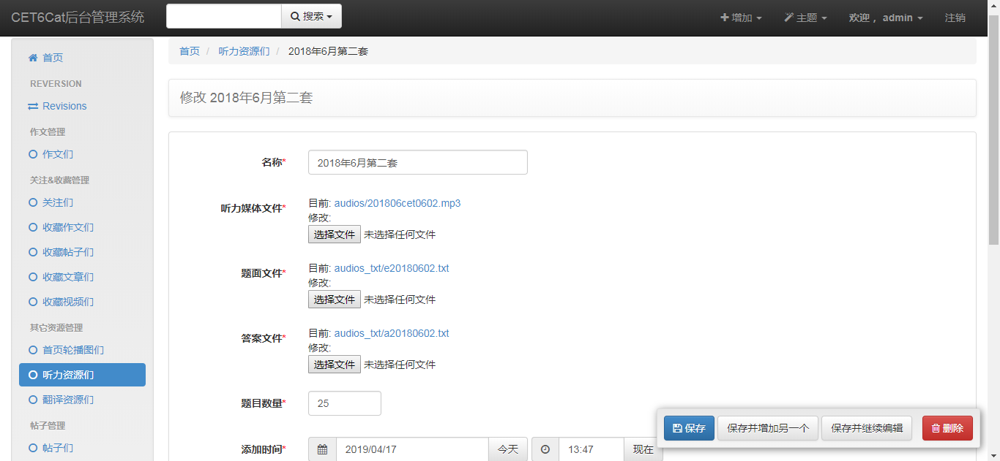

# CET6Cat_Back
CET6Cat英语六级辅导网后端，Django REST framework。


## 前端项目地址
[CET6Cat_Front](https://github.com/LauZyHou/CET6Cat_Front)

## 演示视频
[CET6Cat演示视频-bilibili](https://www.bilibili.com/video/av63516010/)

## 后端运行展示
### API Root

### XAdmin管理员系统


## 项目构建
### 导入环境
``` bash
conda env create -f environment.yml
```
### 创建并填充文件
文件`/CET6Cat/privacy.py`中配置了必要但隐私的信息（如API KEY），按照同目录下的模板文件创建该文件。

### 配置数据库
创建MySQL数据库，并将相关信息配置。数据库使用utf8编码，且选择第一种排序方式。

创建MongoDB数据库并建立相关的Collection，打开mongo命令行并执行：
```
use cet6cat
db.createCollection("fault_words")
db.createCollection("study_num")
db.createCollection("translate")
exit
```
### 运行Task指令
``` bash
python manage.py makemigrations

python manage.py migrate

python manage.py collectstatic

python manage.py createsuperuser
```
注意，在创建超级用户时，需将配置的
```
'users.apps.UsersConfig'
```
暂时改为
```
'users'
```
### 填充数据
填充六级单词数据，直接运行`db_tools/`目录下的`gen_word.py`脚本。

注意，不要重复运行，不然数据库表里的单词就越来越多了（我没有做联合unique约束）。

如果重复运行了怎么办？先把`words_word`表删掉，然后删除表`django_migrations`中生成`words_word`表的那项记录，然后在Task中重新`migrate`就生成了空表，然后再运行上面那个脚本一次。
## 项目运行
启动MySQL服务：
```
net start MySQL Server
```

启动MongoDB服务：
```
net start MongoDB Server
```

启动Redis服务：
```
redis-server
```

从PyCharm配置运行本项目，Environment Variables：
```
PYTHONUNBUFFERED=1
DJANGO_SETTINGS_MODULE=CET6Cat.settings
```
